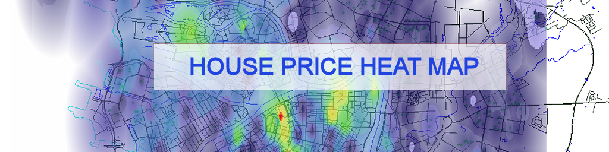

# House Price Prediction Heat Map

House price prediciton project. Predicitions are rendered as colored heat map. Project based on Angular 6.2.1 + ThreeJS.
This project was generated with [Angular CLI](https://github.com/angular/angular-cli) version 6.2.1.

### Overview

This project can run basic intel-based cpu commands like add, mov, inc, etc. Working with 32 bit data and registers only. You can use this project
as a virtual assembler machine inside web browser app.

### Implementation notes

Will be later

## Start working with project

Run `npm install` to load all requied Node packages. They will appear in `node_modules` folder.

## Development server

Run `ng serve` for a dev server. Navigate to `http://localhost:4200/`. The app will automatically reload if you change any of the source files.
Run `ng serve --open` to start dev server and immediately open browser with url `http://localhost:4200/`.

## Code scaffolding

Run `ng generate component component-name` to generate a new component. You can also use `ng generate directive|pipe|service|class|guard|interface|enum|module`.

## Compile and strong syntax check

Run `ng lint` to compile project source codes.

## Build

Run `ng build` to build the project. The build artifacts will be stored in the `dist/` directory. Use the `--prod` flag for a production build.

## Running unit tests

Run `ng test` to execute the unit tests via [Karma](https://karma-runner.github.io).

## Running end-to-end tests

Run `ng e2e` to execute the end-to-end tests via [Protractor](http://www.protractortest.org/).

## Further help

To get more help on the Angular CLI use `ng help` or go check out the [Angular CLI README](https://github.com/angular/angular-cli/blob/master/README.md).
